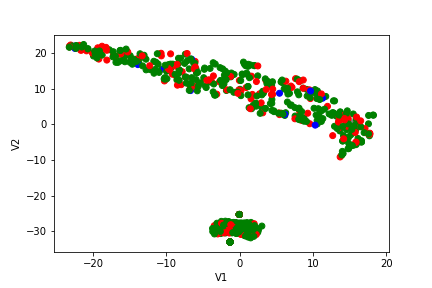

```{r setup, include=FALSE}
knitr::opts_chunk$set(echo = TRUE)
```

##Problem 1
```{r Q1}
library(tidyverse)
library(gbm)

data <- read_csv("weight-height.csv")

#make a new column, true if female, false if male
data$Gender.F <- data$Gender == "Female"
#split into training and test sets
data$label <- c(rep("Train",8000),rep("Test",2000)) %>%
    sample(10000,replace=FALSE)
train <- data %>% filter(label=="Train");
test <- data %>% filter(label=="Test");

#create model
modelGBM <- gbm(Gender.F ~ Height + Weight,
                data = train)
#make predictions using model
pred <- predict(modelGBM, test, type="response");
#calculate accuracy
sum((pred>0.5)==test$Gender.F)/nrow(test);

```
This model has a higher accuracy, 0.90-0.93, compared to an accuracy of up to about 0.5 using the other dataset.

##Problem 2
```{r Q2}
data <- read_csv("char_stats.csv")

#####   1   #####
#exploration in odd looking rows:
#plot a couple of the columns
plot(data$Power)
plot(data$Intelligence)
#sum up how many have these unexpected values
sum(data$Power == 0)
sum(data$Intelligence == 1)
sum(data$Strength == 1)
#test if it is the same subset with these odd values
sum(subset(data, data$Strength == 1 & data$Power == 0)[,"Intelligence"] == 1)

#subset out those rows
data <- subset(data, !(data$Intelligence == 1 & data$Strength == 1 & data$Speed == 1 & data$Durability == 1 & data$Power == 0 & data$Combat == 1))

#####     2     #####
#do PCA and print a summary of components
pcs <- prcomp(data[,3:9])
summary(pcs)

#####     3     #####
#create a set of boxplots to visualize the distribution of data
boxplot(data[,3:8])

#####     4     #####
#create a new column to hold the sum of all the columns except total
data <- data %>% mutate(sum = rowSums(.[3:8]))
#compare sum and total
sum(data$sum != data$Total)

#####     5     #####
#look at proportion of each factor in each PC
pcs$rotation

#####     6     #####
#plot PCA
library(ggfortify)

autoplot(pcs)

```

1. There are irregularities in 177 rows, where the values for Intelligence, Strength, Speed, Durability, and Combat are all 1 and Power is 0. I filtered out these rows as it is unlikely over a quarter of the heroes in this data set have the exact same, very low values for every trait.

2. When including all numeric values, we only need one principal component (which has a cumulative proportion of 0.8635) to get at least 85% of the variation. If we don't include the total, we need 4 components to get at least 85% of the variation in the data. The cumulative proportion of variance with 4 components is 0.85673.

3. Yes, while most seem to range from 0-100 (ish), each column has a slightly different scale, so normalizing would remove any skewed results from values outside of the common range of 0-100.

4. Yes, the total column is the sum of all the other columns except Name and Alignment.
5. Probably not, since it is not adding any new information. The total accounts for the majority of PC1, at about 90%, meaning much of the variation is based on a single value, the total. 
6. There is no clear difference or seperation in the data between good and bad super heros based on these 2 principal components. 

##Problem 3
```{r Q3}

#load in data
data_tsne <- read_csv("tsne.csv")
#plot tsne
p <- ggplot(data_tsne, aes(tsne1, tsne2)) + geom_point(aes(colour = Alignment)) + 
  labs(title="TSNE", xlab="V1", ylab="V2")
plot(p)

```
While there is a clear separation in the data, it does not match with alignment. There may be another trait that causes this separation, but it is not alignment since there is a mixture of the alignments in both clusters.

See Q3.ipynb for python code.


##Problem 4
See Q3.ipynb for python code. Here is the plot:


I could not figure out a colored legend, but green=good, red=bad, blue=neutral, and gray=other. 

##Problem 5
```{r Q5}
library(caret)

data$Align.good <- data$Alignment == "good"
data$Align.good <- factor(data$Align.good)

data$label <- c(rep("Train",345),rep("Test",89)) %>% sample(434,replace=FALSE)
train <- data %>% filter(label=="Train");
test <- data %>% filter(label=="Test");

form <- Align.good ~ Intelligence +
                     Strength +
                     Speed +
                     Durability +
                     Power +
                     Combat +
                     Total

train_ctrl <- trainControl(method = "repeatedcv")
train <- drop_na(train)
gbmFit <- train(form, data = train,
                method = "gbm",
                trControl = train_ctrl,
                verbose = FALSE)
summary(gbmFit)
gbmFit

#glm for final parameters
glmFit <- train(form, data=train,
                method = "glmStepAIC",
                family = "binomial",
                trControl = train_ctrl)
glmFit

```
The best parameters that caret determines for this model are in the order: total, speed, intelligence, strength, combat, power, and durability. Using the AIC metric for a GLM model, caret determined the final parameters to be intelligence, strength, speed, and combat. 

##Problem 6
We cannot report a single number for accuracy, because this number will change based on which subset of data we use for testing and training sets. Models don't have an accuracy. The family of models trained on a dataset has a family of accuracies. The best we can do is provide a distribution of accuracies with different subsets within the dataset used for testing and training sets. 

##Problem 7
First, characterize the results of a model with all features, and create a new model by removing the least important feature. Repeat this process until a model with only one feature is reached, calculating accuracy or a similar metric for each model. Select the model with the highest accuracy. Since this method is so linear, it does not account for all combinations of features, so the absolute best model may get missed.
