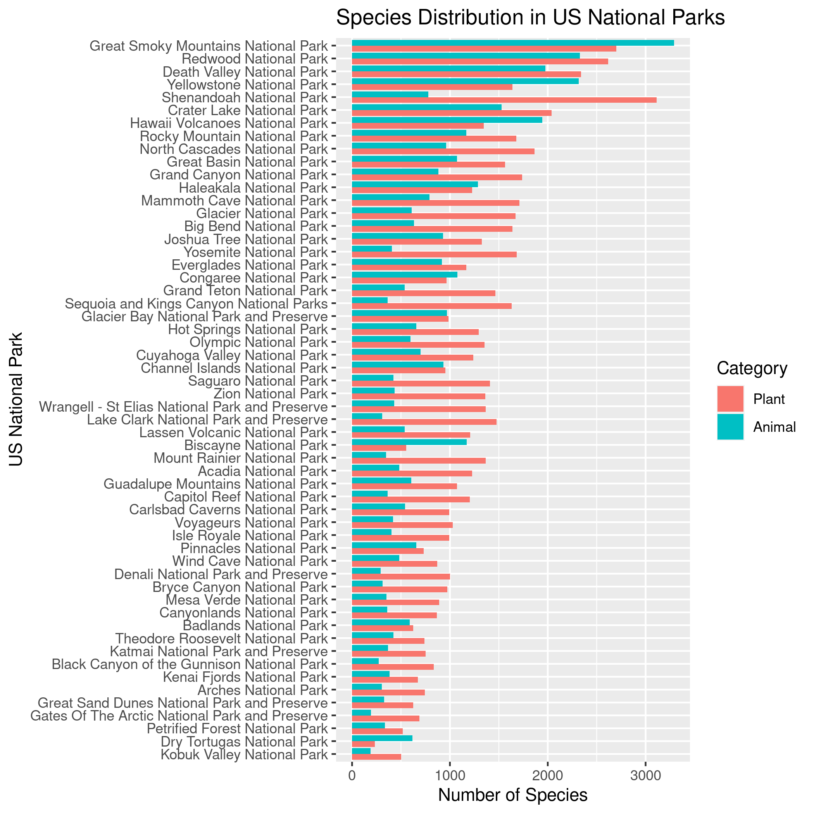

Project 1 Bios 611
==================
National Parks Dataset
----------------------

Proposal
--------

### Introduction

There are many National Parks in America that contain several different species of plants and animals. These national parks are different sizes, and in different locations around the United States.

Does the amount of land devoted to national parks correlate with the number of species found in those parks? Does the location of the park correlate with the number of species found in those parks? Are there more unique plant species or animal species in these parks? Where do certain species live, and which are the most common?

This project will undertake descriptive statistics of several publicaly available data sets. I plan to add a model to see if we can determine where certain species would be found based on the locations of these national parks, and explore information on the most common species and categories of organisms (i.e. plants/animals or mammals/birds/fish/etc.) using interactive plots. I want to fully understand what is in this dataset and create an interactive figure for exploring different species and where they live. 

### Datasets

The datasets I analyze here are publically available on Kaggle and can be downloaded. 
This repo contains an analysis of the US National Park Biodiversity datasets.

### Preliminary Figures

Figure 1 above shows that there is no immediately clear correlation between the number of species in a US National Park and the acreage of that park.

Figure 2 above shows that there also is no immediately clear correlation between the latitude and longitude location of a US National Park and the number of species in that park.

Figure 3 above represents the distribution of the number of plant and animal species in each of the US National Parks. 

While it may be expected that there are more individual organisms in National Parks with more acreage, this trend does not continue to the number of unique species. The location of these parks also does not seem to correlate to the number of unique species, but there is a difference in the number of plant and animal species in each park. Some have more plant than animal species, but most have more animal species than plant species.

Usage
-----

You'll need Docker and the ability to run Docker as your current user. 

To build the container:
    
    > docker build . -t project1-env

This Docker container is based on rocker/verse. To run rstudio server:
    
    > docker run -v `pwd`:/home/rstudio -p 8787:8787 -e PASSWORD = mypass -t project1-env

Then connect to the machine on port 8787.

To run Bash:
    
    > docker run -v `pwd`:/home/rstudio -e PASSWORD=mypass -it l6 sudo -H -u rstudio /bin/bash -c "cd ~/; /bin/bash"

Makefile
========
To build figures as above (for example, figure 1), enter Bash either using the above usage directions or with Rstudio and say:
    
    > make figures/species_number_long_lat.png
