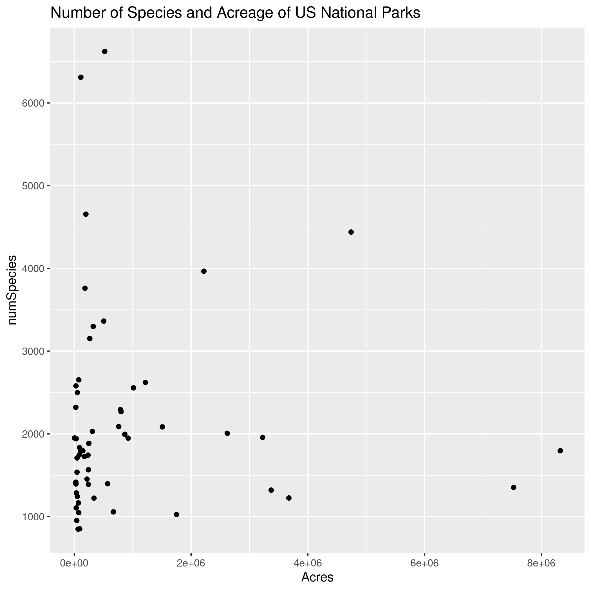
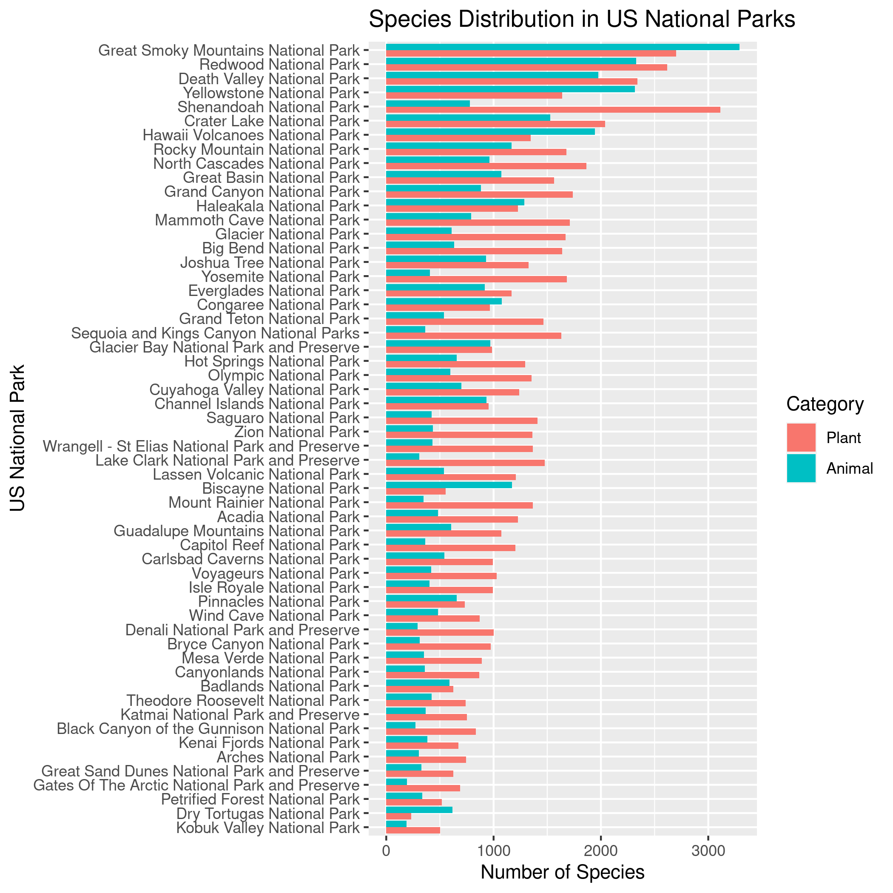
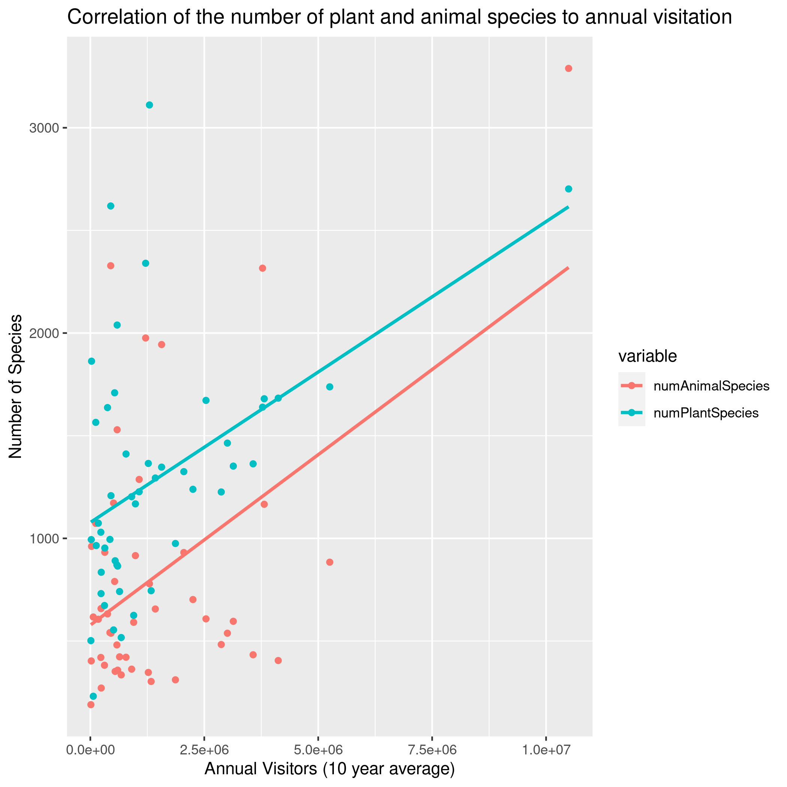
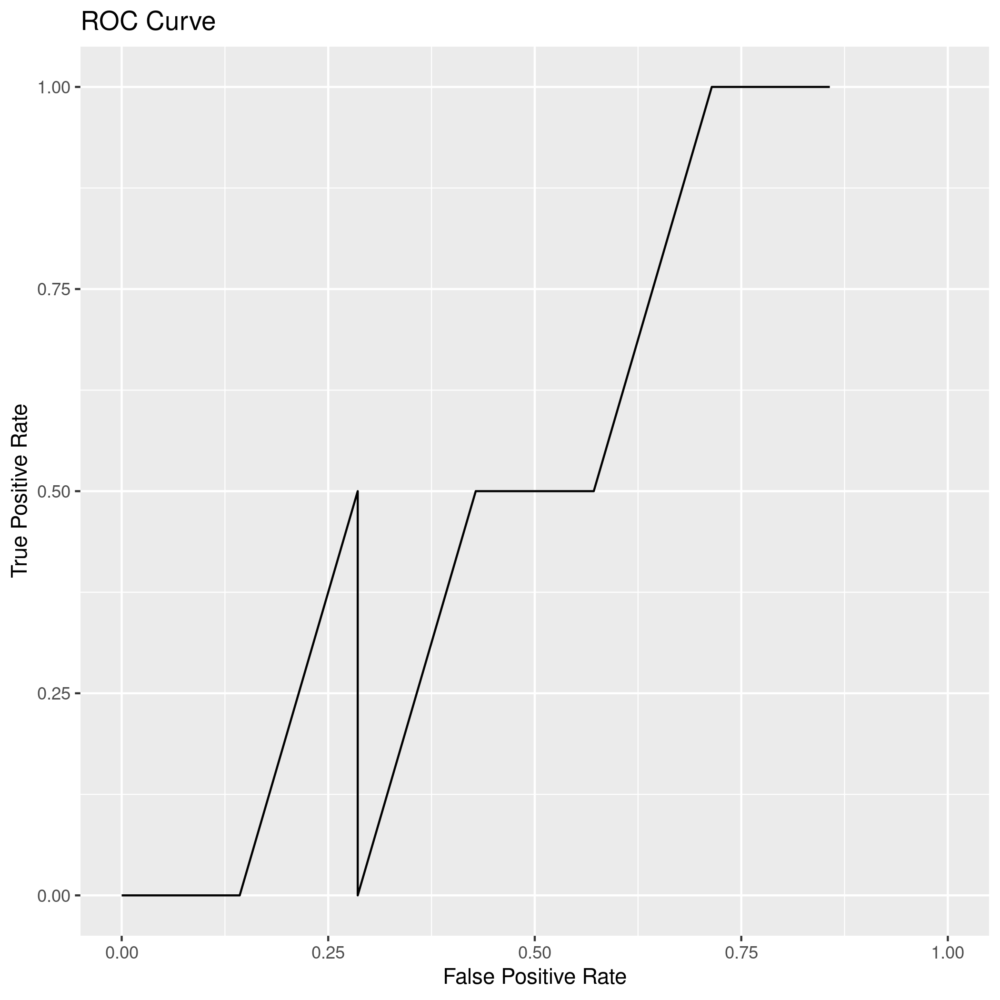
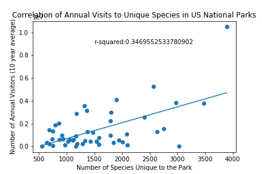

There are 62 national parks in the United States. These parks see different numbers of visitors each year, and one reason could be the number of species of plants and animals one may see at one of these parks. This project will explore the correlation between the number of species and visitation in the US National Parks, and the effects of the number of plant and animal specis. 

Data Sets
=========
The two primary data set used in this project is the [Biodiversity in National Parks Dataset][data1]. Additionally, the average annual number of visitors of these national parks comes from the [Visitors Dataset][data2]. 

Number of Species in National Parks and effect on Visitation
============================================================

The number of unique identified species varies from park to park, and while a larger park has more individual plants and animals, there is no correlation in the acerage of a park and the number of species in the park (Figure 1). These parks, seen in figure 2 ranked by the total number of species, also have differing numbers of plant and animal species. 

Figure 1

Figure 2

How does the number of species correlate to the number of annual visitors in a national park? For this model, a park with a high number of visitors has an annual average number of visitors greater than 1,000,000 over the past 10 years (2010-2019). The following model has an F1 score of about 0.8. Since there are less than 50 parks with all the data needed for the model, the validation/test sets only have 9 data points each, so the ROC curve has very sharp spikes instead of a smooth curve (Figure 3).

Figure 3

The significant variables in the model are the total number of species, the number of plant species, and the number of animal species. Although one may believe a larger park will bring in more visitors per year, the most significant variable in the model is the number of unique plant species. The number of plant species also has a stronger positive correlation with the annual number of visitors averaged from the last 10 years than the number of animal species (Figure 4). These two and the total number of species are the only factors that had a positive correlation with visitors above 0.45. The Pearson correlations for total species, animal species, and plant species to the number of visitors are 0.484, 0.487, and 0.460, respectively. 

Figure 4

Based on this model, if a new region is to be selected for a new national park, one important consideration should be the number of species in the region and especially the number of plant species there. 

Further analysis could include state parks, as this would add many more data points which could improve the accuracy of the model. It would also be interesting to determine the effects of each specific species on the number of visitors, perhaps even introducing common and rare species as factors. A common species would be one found in a multitude of parks, and a rare species would be found in only a few parks. This dataset also may not be complete, as there may be many more rare species that have not been observed in one of the parks. This may more commmon in larger state parks, meaning it may be more likely that larger parks will have a lower recorded number of species than actual number of species. 

Python Integration
============================================================

For the python integration, I decided to look into if more people visit parks with a higher number of species unique to that US National Park, meaning the only recorded observation of that species is in a single park. There seems to be strong correlation on the diagonal, but there are also quite a few parks that have lower annual visitors but a higher number of unique species, with a r-squared value of 0.347 for linear regression. This is not strong evidence for a correlation between annual visitors and rare species for national parks in the United States.

To create the plot from the makefile, run:
    
    > make figures/uniqueSpeciesVisits.png

***

[data1]:https://www.kaggle.com/nationalparkservice/park-biodiversity
[data2]:https://irma.nps.gov/STATS/SSRSReports/National%20Reports/Annual%20Visitation%20By%20Park%20(1979%20-%20Last%20Calendar%20Year)
